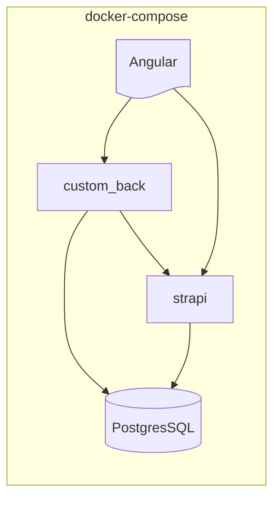

[index](../README.md)

# Document d'Architecture Technique

```mermaid
flowchart BT
subgraph docker-compose
    front@{ shape: doc, label: "Angular" }
    strapi@{ shape: rect, label: "strapi" }
    custom_back@{ shape: rect, label: "custom_back" }
    db@{ shape: cyl, label: "PostgresSQL"  }

    custom_back --> db
    custom_back --> strapi
    front --> strapi
    front --> custom_back
    strapi --> db
end

```