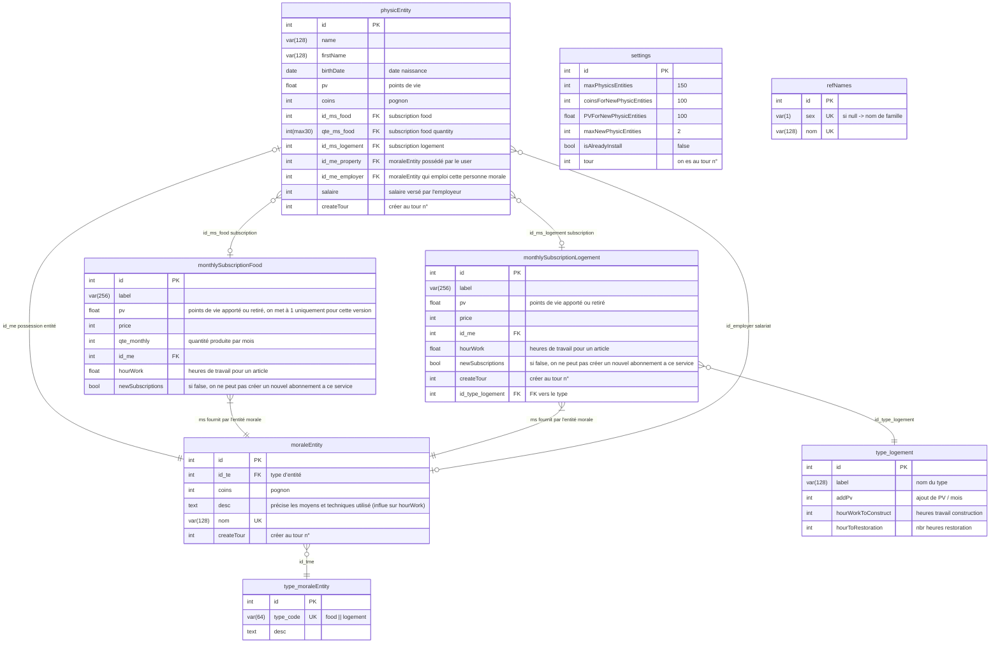

[index](../README.md)

# modèle de donnée

```mermaid
erDiagram

    pe }o--o| ms_food : "id_ms_food subscription"
    pe }o--o| ms_logement : "id_ms_logement subscription"
    pe |o--|| me : "id_me possession entité"
    ms_food }|--|| me : "ms fournit par l'entité morale"
    ms_logement }|--|| me : "ms fournit par l'entité morale"
    pe }o--o| me : "id_employer salariat"
    me }o--|| tme : "id_tme"
    ms_logement }o--|| type_logement : "id_type_logement"

    pe[physicEntity] {
        int id PK
        var(128) name
        var(128) firstName
        date birthDate "date naissance"
        float pv "points de vie"
        int coins "pognon"
        int id_ms_food FK "subscription food"
        int(max30) qte_ms_food FK "subscription food quantity"
        int id_ms_logement FK "subscription logement"
        int id_me_property FK "moraleEntity possédé par le user"
        int id_me_employer FK "moraleEntity qui emploi cette personne morale"
        int salaire "salaire versé par l'employeur"
        int createTour "créer au tour n°"
    }
    ms_food[monthlySubscriptionFood] {
        int id PK
        var(256) label
        float pv "points de vie apporté ou retiré, on met à 1 uniquement pour cette version"
        int price
        int qte_monthly "quantité produite par mois"
        int id_me FK
        float hourWork "heures de travail pour un article"
        bool newSubscriptions "si false, on ne peut pas créer un nouvel abonnement a ce service"
    }
    ms_logement[monthlySubscriptionLogement] {
        int id PK
        var(256) label
        float pv "points de vie apporté ou retiré"
        int price
        int id_me FK
        float hourWork "heures de travail pour un article"
        bool newSubscriptions "si false, on ne peut pas créer un nouvel abonnement a ce service"
        int createTour "créer au tour n°"
        int id_type_logement FK "FK vers le type"
    }
    type_logement[type_logement] {
        int id PK
        var(128) label "nom du type"
        int addPv "ajout de PV / mois"
        int hourWorkToConstruct "heures travail construction"
        int hourToRestoration "nbr heures restoration"
    }
    me[moraleEntity] {
        int id PK
        int id_te FK "type d’entité"
        int coins "pognon"
        text desc "précise les moyens et techniques utilisé (influe sur hourWork)"
        var(128) nom UK
        int createTour "créer au tour n°"
    }
    tme[type_moraleEntity] {
        int id PK
        var(64) type_code UK "food || logement"
        text desc
    }
    settings {
        int id PK
        int maxPhysicsEntities "150"
        int coinsForNewPhysicEntities "100"
        float PVForNewPhysicEntities "100"
        int maxNewPhysicEntities "2"
        bool isAlreadyInstall "false"
        int tour "on es au tour n°"
    }
    refNames {
        int id PK
        var(1) sex UK "si null -> nom de famille"
        var(128) nom UK
    }
```