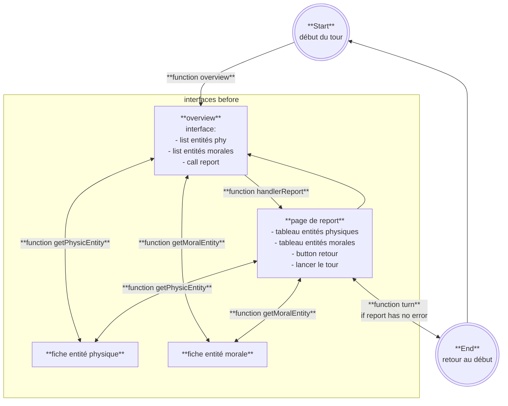

[index](../README.md)

# sequence générale (interface <--function-->)

```mermaid
flowchart TB

    Start --**function overview**--> overview
    overview <--**function getPhysicEntity**--> physic_entities
    overview <--**function getMoralEntity**--> morale_entities
    overview --**function handlerReport**--> report
    report --> overview
    report <--**function getPhysicEntity**--> physic_entities
    report <--**function getMoralEntity**--> morale_entities
    report <--"**function turn**
        if report has no error"--> Stop
    Stop --> Start

    Start((("**Start**
        début du tour")))

    subgraph interfaces before

    overview["**overview**
        interface:
        - list entités phy
        - list entités morales
        - call report"]
    
        physic_entities["**fiche entité physique**"]
    
        morale_entities["**fiche entité morale**"]

        report["**page de report**
            - tableau entités physiques
            - tableau entités morales
            - button retour
            - lancer le tour"]
    end

    Stop((("**End**
        retour au début")))
```